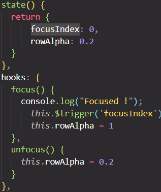
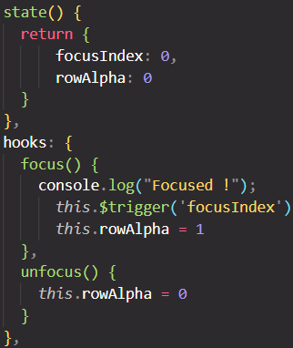

# Issue
When I set the alpha value to 0.2 in state and toggle between this value (0.2) and 1 when the Row component is focused and unfocused, the following issue is observed 
[alpha-issue](./README/alpha-issue.mp4)

However when the alpha value is set to 0 in state and toggle between this value (0) and 1, the issue goes away - please see [alpha-working](./README/alpha-working.mp4)

